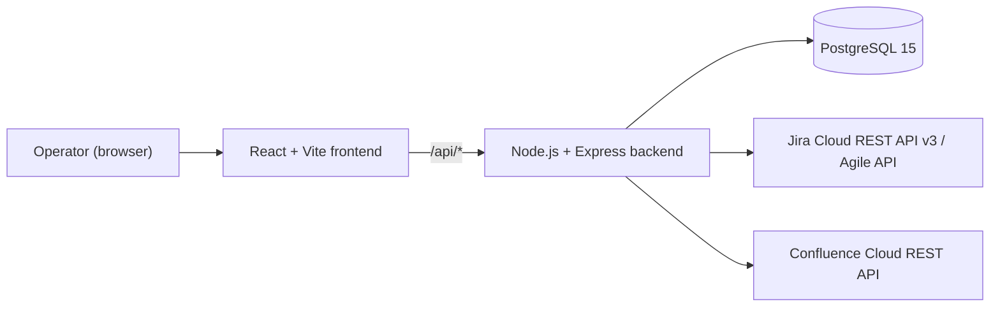

# Implementation Plan: Jira Sprint Progress Dashboard (Confluence Publishing)

**Based on**: `spec/specification.md` (as amended), `spec/constitution.md`, `spec/clarify.md`
**Status**: Draft

## Architecture Overview

- **Frontend**: React 18 + Vite SPA. Calls the backend only — never Jira/Confluence directly (per constitution).
- **Backend**: Node.js + Express REST API. Owns all Jira/Confluence API calls, config persistence, and snapshot caching.
- **Database**: PostgreSQL 15 via Docker Compose. Stores `Dashboard Config` (single row), `Board Config`, `Sprint Snapshot`, `Blocker Item`.
- **Deployment**: Single local operator machine only (per resolved spec) — `docker-compose up` runs Postgres; frontend/backend run locally (dev servers or containers). No auth layer, no multi-instance concerns.

## Data Model (Phase 1 target)

| Table | Key Columns |
|---|---|
| `dashboard_config` | `id` (single row), `confluence_page_id` |
| `board_config` | `id`, `board_id`, `display_name`, `jira_project_key` |
| `sprint_snapshot` | `id`, `board_config_id` (FK), `completion_pct`, `burndown_data` (JSON), `fetched_at`, `fetch_status` (`ok` \| `error`), `error_message` |
| `blocker_item` | `id`, `sprint_snapshot_id` (FK), `issue_key`, `summary`, `reason` (`status` \| `label` \| `overdue`), `due_date` |

Schema changes go through migrations (constitution requirement) — migration tool choice is a Phase 1 task.

## API Surface (Phase 2 target)

| Method | Path | Purpose |
|---|---|---|
| `GET` | `/api/dashboard` | Return latest cached snapshot for all boards (FR-014) |
| `POST` | `/api/dashboard/refresh` | Trigger fetch → persist → publish-to-Confluence flow (FR-001–FR-006, FR-010–FR-013) |
| `GET` | `/api/config/boards` | List configured boards |
| `POST` | `/api/config/boards` | Add a board (FR-007) |
| `DELETE` | `/api/config/boards/:id` | Remove a board (FR-007) |
| `GET`/`PUT` | `/api/config/confluence-page` | Read/update target Confluence page ID (FR-008) |

## Phases & Milestones

### Phase 0 — Project Setup
*Goal: a runnable skeleton, nothing functional yet.*
- Scaffold `frontend/` (Vite + React) and `backend/` (Express) per existing `web-app/` skeleton conventions.
- Add `docker-compose.yml` service for PostgreSQL 15 with a named volume.
- Add `.env.example` for Jira/Confluence credentials (FR-009) and DB connection string.
- Choose and wire a migration tool (resolves Gap #7); create initial empty migration.

**Milestone 0**: `docker-compose up` starts Postgres; backend connects and runs migrations; frontend renders a placeholder page.

### Phase 1 — Foundational Data Layer
*Goal: schema and config persistence exist, independent of Jira/Confluence.*
- Implement migrations for `dashboard_config`, `board_config`, `sprint_snapshot`, `blocker_item`.
- Implement `board_config` and `dashboard_config` CRUD at the service layer (FR-007, FR-008).
- Seed a single `dashboard_config` row on first run (enforces single-row constraint from Key Entities).

**Milestone 1**: Config can be created/read/updated/deleted directly against Postgres (service-layer or API-level tests), with no Jira/Confluence dependency yet.

### Phase 2 — User Story 1 + User Story 2 (P1): Core Dashboard & Confluence Publish
*This is the MVP slice — both P1 stories are delivered together since Confluence publishing depends on the same fetch pipeline as the dashboard.*
- Backend: Jira client — fetch sprint issues/story points per board (FR-001), compute completion % (FR-002), compute blockers using the OR-combination rule (FR-003, per clarify.md item left to implementation), fetch burndown data (FR-004 — verify correct Jira API surface first, per clarify.md risk note).
- Backend: per-board error isolation — a failed board does not abort the others (FR-011); persist `fetch_status`/`error_message` per snapshot.
- Backend: Confluence client — render combined dashboard content (one section per board, error placeholder for failed boards) and overwrite the configured page in place (FR-006); leave content unchanged only on a publish-call failure itself (FR-012).
- Backend: `POST /api/dashboard/refresh` orchestrates fetch-all-boards → persist snapshots → publish to Confluence.
- Frontend: dashboard view rendering completion %, blockers, burndown per board (FR-005); "no active sprint" state handling (Acceptance Scenario 1.2).

**Milestone 2 (MVP)**: Running a refresh with at least one configured board updates both the in-app dashboard and the Confluence page; a 2-of-3-boards-succeed scenario still publishes partial results with an error placeholder (Acceptance Scenario 2.3). All User Story 1 and User Story 2 acceptance scenarios pass.

### Phase 3 — User Story 3 (P2): Config Management UI
*Builds on Phase 1's config persistence; exposed to the operator via the UI.*
- Frontend: simple settings page/section to add/remove board IDs and edit the Confluence page ID.
- Backend: surface clear configuration errors when Jira/Confluence credentials are missing/invalid at refresh time (Acceptance Scenario 3.2).

**Milestone 3**: Operator can add a new board through the UI and see it appear in the dashboard on the next refresh, with zero code changes (SC-004).

### Phase 4 — User Story 4 (P3): Manual Refresh UX
*Smallest increment; mostly UI polish over the Phase 2 refresh endpoint.*
- Frontend: "Refresh" button wired to `POST /api/dashboard/refresh`, with loading state.
- Backend/Frontend: prevent duplicate concurrent refresh (FR-013) — simple in-process guard (single-operator deployment, per clarify.md) and a "refresh already running" UI message.

**Milestone 4**: Clicking "Refresh" updates the dashboard and Confluence page; a second click while one is in-flight is blocked with a clear message (Acceptance Scenario 4.2).

### Phase 5 — Hardening & Wrap-up
- Automated backend tests for the fetch/blocker-flagging/publish logic (constitution's testing mandate); frontend tests for the dashboard render and refresh flow.
- Manual end-to-end verification against a real Jira/Confluence sandbox.
- Update `README.md`/setup docs for running the app locally via Docker Compose.

**Milestone 5 (Done)**: All functional requirements (FR-001–FR-014) and success criteria (SC-001–SC-005) are met; constitution's testing requirement satisfied.

## Sequencing Notes

- Phases 0–1 are prerequisites for everything else and should be completed first.
- Phase 2 (P1 stories) is the MVP and delivers the feature's core value end-to-end; Phases 3–4 (P2/P3) are additive and can be reprioritized or deferred without breaking the MVP.
- Items marked **out of scope** in `spec/clarify.md` (auth, rate-limit handling, audit logging, retention policy, performance targets, etc.) are intentionally excluded from all phases above.
